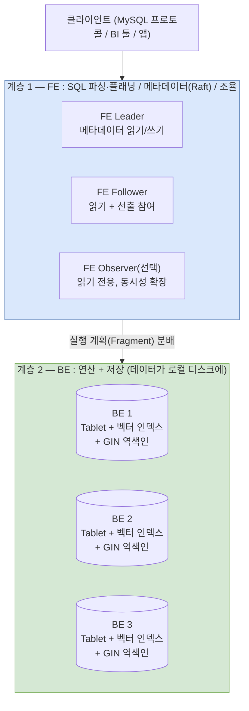
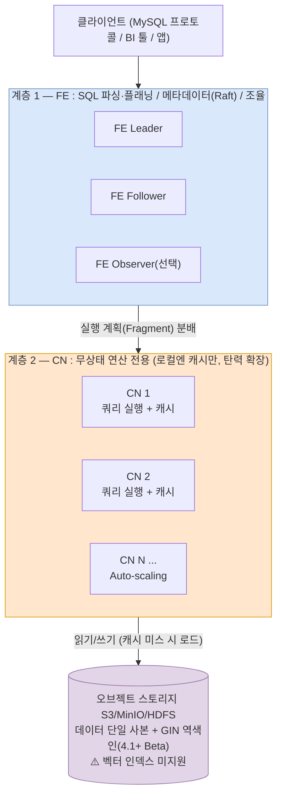
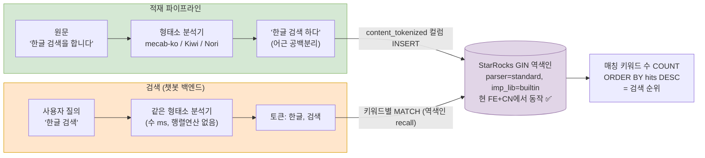

# 6. 현재 운영 환경에서 임베딩 유사도 검색 가능 여부 조사

> 조사일: **2026-07-27**
> 기준 버전: 오픈소스(OSS) StarRocks **4.1.1**
> 목적: **현재 서비스 클러스터의 StarRocks 환경**에서 임베딩(벡터) 유사도 검색이 가능한지 확인

---

## 결론 (TL;DR)

**❌ 현재 환경에서는 불가능. 벡터 인덱스는 FE + BE (shared-nothing) 구성에서만 사용 가능하다.**

| 확인 항목 | 결과 |
|-----------|------|
| 현재 배포 구성 | **FE + CN = shared-data 모드** |
| 벡터 인덱스 지원 조건 | **FE + BE = shared-nothing 모드 전용** (v3.4+, 실험 기능) |
| 현재 환경에서 임베딩 검색 | ❌ **불가능** — CN(shared-data)은 벡터 인덱스 미지원 |
| 가능하게 하려면 | FE + BE 기반 클러스터를 별도 구성해야 함 (→ 워크로드 이관 리스크로 기각) |
| **채택한 대응 방안** | ✅ **임베딩 포기, 적재 시 형태소 토큰 주입 + GIN 역색인 + 매칭 수 랭킹** — 현 FE+CN에서 가능 (§4) |

---

## 1. 현재 환경 확인 과정

1. 서비스 클러스터에 접속
2. 내 사번 네임스페이스의 StarRocks 파드 이미지 확인:
   - `starrocks/cn-ubuntu:4.1.1`
   - `starrocks/fe-ubuntu:4.1.1-sk...`
3. **CN 이미지가 사용되고 있음** → 현재 배포는 **FE + CN 조합 = shared-data 모드**
4. 벡터 인덱스는 shared-nothing(FE + BE) 전용이므로, 이 구성에서는 임베딩 검색을 켤 수 없음

---

## 2. StarRocks 아키텍처 — 2계층 구조

StarRocks는 Milvus(proxy/query/data/index node 분리)나 OpenSearch(노드 롤 지정)와 달리 **FE + BE(또는 CN)의 2계층 고정 구조**다. 배포 모드는 계층 2에 무엇을 쓰느냐로 갈린다.

**Shared-Nothing (FE + BE) — 벡터 인덱스 지원 모드**



**Shared-Data (FE + CN) — ★ 현재 우리 환경**



### 계층 1 — FE (Frontend)

- SQL 파싱·플래닝, 메타데이터 관리, 클러스터 조율 담당 (Java)
- 역할 3종: **Leader**(메타데이터 읽기/쓰기, Raft 선출) / **Follower**(읽기 + 선출 참여) / **Observer**(읽기 전용, 선출 불참 — 쿼리 동시성 확장용)
- FE는 "어떤 Tablet이 어느 노드에 있는지" 지도를 들고 있다가, 쿼리 시 해당 노드에만 실행 계획을 보냄 (테이블은 행 단위로 해시 버킷팅되어 여러 노드에 분산됨)

### 계층 2 — BE vs CN

| | BE (Backend) | CN (Compute Node) |
|---|---|---|
| 역할 | 연산 + **저장** (C++) | 연산 전용, **무상태** |
| 데이터 위치 | 로컬 디스크 (Tablet + 인덱스) | 오브젝트 스토리지 (S3/MinIO 등), 로컬엔 캐시만 |
| 배포 모드 | shared-nothing | shared-data ← **현재 환경** |

### 각 모드의 장단점

| | Shared-Nothing (FE+BE) | Shared-Data (FE+CN) |
|---|---|---|
| 쿼리 성능 | 데이터가 로컬에 있어 유리 | 캐시 미스 시 오브젝트 스토리지 조회 지연 |
| 가로 확장(노드 추가) | ✅ 되지만 **Tablet 재분배 필요** — 수 시간, 부하 큼 | ✅ 옮길 데이터 없음 — **초 단위, 탄력적** |
| 저장·연산 독립 확장 | ❌ 항상 같이 늘어남 | ✅ 각각 따로 (S3는 사실상 무한) |
| 축소(scale-in) | 부담 큼 (데이터 빼내야 함) | 쉬움 (그냥 종료) |
| 스토리지 비용 | 복제본 3개 × 로컬 디스크 | 단일 사본 + 저렴한 오브젝트 스토리지 |
| 워크로드 격리 | Resource Group (논리적 칸막이만) | Compute Group / Multi-Warehouse (물리적 분리, 4.0+ OSS) |
| **벡터 인덱스** | ✅ **지원 (v3.4+, 실험 기능)** | ❌ **미지원** |
| GIN 역색인(전문 검색) | ✅ v3.3+ | ✅ 4.1+ built-in (Beta) |

> 아키텍처 상세 다이어그램: [`starrocks-architecture.drawio`](./starrocks-architecture.drawio) (탭 4개: 두 모드 2계층 구조 / 확장 비교 / 데이터 분배)

---

## 3. 임베딩(벡터) 검색 지원 현황 — 2026-07-27 기준

### 지원 범위

- **v3.4+의 shared-nothing 클러스터에서만** 벡터 인덱스(ANNS) 지원. 공식 문서 원문:
  > "The vector index feature is only supported in **shared-nothing clusters** of v3.4 or later."
- 여전히 **실험(experimental) 기능**: FE 설정 `enable_experimental_vector = true` 필요, 테이블당 벡터 인덱스 1개 제한
- 인덱스 종류: HNSW(저지연·정밀) / IVFPQ(고압축·대규모), 검색은 `approx_l2_distance` / `approx_cosine_similarity` 함수 사용 → 상세: [`01-embedding-vector-search.md`](./01-embedding-vector-search.md)

### Shared-data(CN) 지원 전망

- 공식 shared-data 기능 지원 목록에 벡터 인덱스 **없음**
- **StarRocks 2026 로드맵**(GitHub #67632)에 shared-data용 "Vector index"가 **계획 항목으로만** 존재 — 세부 내용·일정 없음
- 현재 최신 릴리스는 4.1.1(2026-06-18)이며 그 이후는 하위 브랜치 버그픽스뿐 → **가까운 시일 내 CN 지원을 기대하고 설계하는 것은 위험**

### 참고 — 검색 기능 전반 (기존 조사 요약)

| 기능 | OSS 4.1.1 지원 |
|------|:---:|
| 벡터 유사도 검색 | ✅ shared-nothing 전용, 실험 기능 |
| 토크나이저 전문 검색 (GIN + MATCH) | ✅ 단, 불리언 필터 성격 (관련성 점수 없음) |
| BM25 스코어링 / 엔진 내장 RRF | ❌ 없음 (상용 배포판 전용, 로드맵에도 미포함) |
| 하이브리드 검색 | ⚠️ 직접 조립 (필터+벡터 정렬 또는 앱단 RRF) → [`04-fusion-and-oss-implementation.md`](./04-fusion-and-oss-implementation.md) |

---

## 4. 해결 방안 검토 (2026-07-27)

현재 클러스터(FE + CN)를 그대로 두고는 임베딩 검색을 켤 수 없다. 4가지 방안을 검토했다.

| # | 방안 | 판정 | 사유 |
|---|------|:----:|------|
| 1 | CN → BE 모드 변경 | ❌ 기각 | 이미 대량 데이터 분석·공유 워크로드가 올라가 있어 모드 변경(사실상 클러스터 재구축 + 데이터 이관) 리스크가 큼 |
| 2 | OpenSearch 추가 | ❌ 제외 | 장기 기획 사안이며 관리할 전문 담당자 부재 |
| 3 | 챗봇 백엔드에 임베딩 검색 직접 구축 | ❌ 기각 | 매우 한정적인 메타데이터만 가능. 벡터(행렬) 연산으로 CPU 과부하·모델 OOM 위험 → 결국 별도 도커 컴포넌트로 분리해야 해서 관리 부담 (너무 도전적) |
| 4 | **임베딩 포기 + 적재 시 토크나이저 변환 주입 (역색인 + 매칭 수 랭킹)** | ✅ **채택** | **현 FE+CN 클러스터에서 모드 변경 없이 가능** (GIN 역색인이 shared-data 4.1+ 지원) |

### 채택안(4번) 상세 — 형태소 토큰 주입 + GIN 역색인 + 매칭 수 랭킹

"리버스 인덱싱"은 역색인(inverted index)을 뜻하며, StarRocks의 **GIN 인덱스가 정확히 그것**이다. 공식 문서 확인 결과(2026-07-27):

- **shared-data(CN)에서 v4.1부터 지원** — 단 CLucene 구현은 불가, **built-in 구현(`imp_lib=builtin`) 필수** → 현재 4.1.1 환경에서 버전 조건 충족
- 필요 설정: FE 플래그 `enable_experimental_gin = true`, 테이블 속성 `replicated_storage = false`
- 지원 테이블: Duplicate Key(전 버전), Primary Key(4.0+)
- 제약: MATCH 계열은 WHERE 절 전용(pushdown), english/standard 파서는 검색어 소문자 필요, 관련성 점수 함수 없음

**동작 구조** (한국어 형태소 처리는 [`02-tokenizer-fulltext-search.md`](./02-tokenizer-fulltext-search.md)의 외부 주입 패턴):



```sql
ADMIN SET FRONTEND CONFIG ("enable_experimental_gin" = "true");

CREATE TABLE documents (
    id BIGINT,
    content STRING,            -- 원본 (표시용)
    content_tokenized STRING,  -- 형태소 분석 결과 주입 (검색용)
    INDEX idx_tok (content_tokenized) USING GIN("parser"="standard", "imp_lib"="builtin")
) ENGINE=OLAP DUPLICATE KEY(id)
DISTRIBUTED BY HASH(id)
PROPERTIES ("replicated_storage"="false");

-- 질의 "한글 검색" → 토큰 [한글, 검색] → 매칭 키워드 수로 랭킹
SELECT d.id, d.content, t.hits
FROM (
    SELECT id, COUNT(*) AS hits FROM (
        SELECT id FROM documents WHERE content_tokenized MATCH '한글'
        UNION ALL
        SELECT id FROM documents WHERE content_tokenized MATCH '검색'
    ) m GROUP BY id
) t JOIN documents d ON d.id = t.id
ORDER BY t.hits DESC, d.id DESC   -- 동률은 최신순 등 보조 정렬
LIMIT 10;
```

**적재(INSERT) 예시** — 핵심은 INSERT 전에 형태소 분석을 마쳐서 `content_tokenized`에 함께 넣는 것:

```sql
-- 소량/테스트용: INSERT INTO VALUES
INSERT INTO documents (id, content, content_tokenized) VALUES
    (1, '한글 검색을 합니다',        '한글 검색 하다'),
    (2, 'StarRocks 벡터 인덱스 조사', 'starrocks 벡터 인덱스 조사'),
    (3, '하이브리드 검색이 필요하다',  '하이브리드 검색 필요 하다');
-- ※ english/standard 파서는 검색어가 소문자여야 하므로 영문 토큰은 소문자로 넣는다
```

실전 파이프라인(Python, MySQL 프로토콜 — FE 쿼리 포트 9030):

```python
from kiwipiepy import Kiwi
import pymysql

kiwi = Kiwi()

def tokenize(text: str) -> str:
    """명사(NN*)/동사(VV)/형용사(VA) 어근만 추출해 공백 분리 + 소문자화.
    검색 시에도 반드시 이 함수를 그대로 사용한다."""
    tokens = [t.form for t in kiwi.tokenize(text)
              if t.tag.startswith(('NN', 'VV', 'VA'))]
    return ' '.join(tokens).lower()

conn = pymysql.connect(host='<FE_HOST>', port=9030,
                       user='<USER>', password='<PW>', db='<DB>')
rows = [(1, '한글 검색을 합니다'), (2, 'StarRocks 벡터 인덱스 조사')]
with conn.cursor() as cur:
    cur.executemany(
        "INSERT INTO documents (id, content, content_tokenized) VALUES (%s, %s, %s)",
        [(i, c, tokenize(c)) for i, c in rows])
conn.commit()
```

대량 적재는 Stream Load(HTTP) 권장 — CSV/JSON을 형태소 분석 후 파일로 만들어 밀어넣는다:

```bash
curl --location-trusted -u <USER>:<PW> \
     -H "label:docs_load_20260727_001" \
     -H "column_separator:|" \
     -H "columns: id, content, content_tokenized" \
     -T docs.csv \
     http://<FE_HOST>:8030/api/<DB>/documents/_stream_load
```

**적재 시 유의점**:

- StarRocks의 INSERT는 건당 하나의 적재 트랜잭션이다. **한 건씩 반복 INSERT하면 버전이 과다 생성되어 compaction 부담** → 배치(수백~수천 건)로 묶어서 넣을 것 (`executemany` 또는 Stream Load)
- 지속 유입(스트림)이라면 Kafka 연동 **Routine Load**가 정석 — 단, 이 경우에도 형태소 분석은 Kafka에 넣기 전 프로듀서 쪽에서 수행
- 기존 데이터 백필: 원본 테이블에 `content_tokenized` 컬럼을 추가한 뒤, 외부에서 형태소 분석한 결과를 위 방법으로 재적재하거나 `INSERT INTO new_table SELECT ...` + 앱단 변환으로 이관

각 MATCH가 역색인을 타므로 recall이 빠르고, 랭킹(COUNT)은 후보에 대해서만 계산된다. 키워드 5~10개 수준이면 UNION 팬아웃 부담도 없다.

**옵션 3의 우려와 비교**: 질의 시점에 챗봇 백엔드가 하는 일은 형태소 분석 한 번뿐(수 ms, 행렬 연산 없음). 임베딩 모델 같은 CPU 과부하·OOM 위험이 없고, 무거운 recall·랭킹은 전부 StarRocks가 담당한다.

**한계 (수용한 트레이드오프)**:

1. **점수의 거칠기** — 매칭 키워드 수는 TF(문서 내 등장 횟수)·IDF(단어 희귀도)를 반영 못 함. 필요 시 개선: 토큰을 `ARRAY<STRING>` 컬럼에도 저장해 GIN으로 후보를 좁힌 뒤 `array_filter`로 TF 계산, 또는 배치로 단어→문서수 사전 테이블을 만들어 조인하는 수제 TF-IDF까지 SQL로 가능. 1단계는 hit-count로 시작 권장
2. **의미 검색 불가** — "자동차"로 "차량" 문서를 못 찾음 (임베딩 포기의 대가). 형태소 분석 단계에 동의어 사전을 태우면 일부 보완 가능
3. **적재·검색에 반드시 같은 형태소 분석기** 사용 (규칙이 다르면 매칭 실패)

**⚠️ 주의**: shared-data GIN은 4.1에서 **Beta**. 도입 전 실데이터 일부로 색인 생성·검색 지연·적재 성능을 검증하는 PoC 선행 필요.

### (참고) 기각한 방안들의 원론적 방법

- 방안 1 관련: FE+BE 신규 구성 시 PoC는 `starrocks/allin1-ubuntu` 이미지로 빠르게 검증 가능, `enable_experimental_vector = true` 필요. BE는 가로 확장에 Tablet 재분배 비용이 따르므로 초기 설계를 여유 있게
- 방안 3 관련: CN의 벡터 인덱스 지원을 기다리는 것도 이론상 선택지지만, 2026 로드맵에 항목만 있어 일정 예측 불가 → 비권장

---

## 참고 링크 (2026-07-27 확인)

- [Vector Index | StarRocks 공식 문서](https://docs.starrocks.io/docs/table_design/indexes/vector_index/) — "shared-nothing only" 명시, 실험 기능·제약사항
- [Feature Support: Shared-data Clusters | StarRocks](https://docs.starrocks.io/docs/deployment/shared_data/feature-support-shared-data/) — shared-data 지원 기능 목록 (벡터 인덱스 없음)
- [Architecture | StarRocks](https://docs.starrocks.io/docs/introduction/Architecture/) — FE/BE/CN 구조, FE 역할
- [Data distribution | StarRocks](https://docs.starrocks.io/docs/table_design/data_distribution/) — 파티션·버킷(Tablet) 행 단위 분산
- [StarRocks Roadmap 2026 · Issue #67632](https://github.com/StarRocks/starrocks/issues/67632) — shared-data 벡터 인덱스 계획 항목
- [Releases · StarRocks/starrocks](https://github.com/StarRocks/starrocks/releases) — 최신 릴리스 확인 (4.1.1이 최신)
- [Full-Text Search Capability Development & Optimization Plan · Issue #61827](https://github.com/StarRocks/starrocks/issues/61827) — 전문 검색 로드맵 (BM25 미포함)
